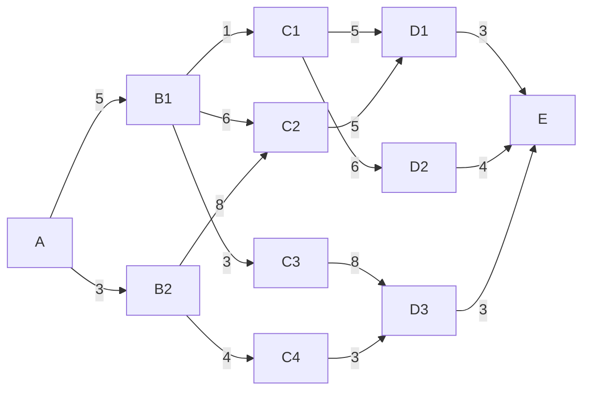

__*待完成*__

## 多阶段过程决策的最优化问题

!!! tldr "题目及注解"
    求上图从 $A$ 到 $E$ 的最短距离  
    $K$: 阶段 
    $D(X_I, (X+1)_J)$: 从 $X_I$ 到 $(X+1)_J$ 的距离 
    $F_K(X_I)$: $K$ 阶段下 $X_I$ 到终点 $E$ 的最短距离

倒推:
$$
K=4\qquad F_4(D_1)=3\qquad F_4(D_2)=4\qquad F_4(D_3)=3
$$
$$
K=5\qquad F_3(C_1)=min(D(C_1,D_1)+F_4(D_1),D(C_1,D_2)+F_4(D_2))=min(5+3,6+4)=8
F_3(C_2)
$$
