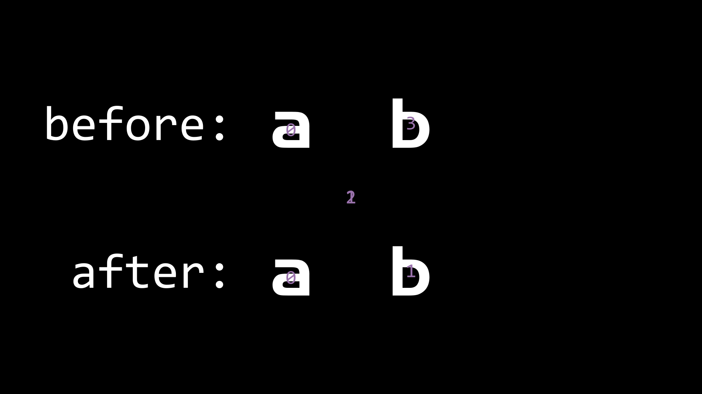

在使用manim时,对于Text类,会有一些bug,我尝试修复了它们

1. 在`shaders`分支下无法使用Text类
2. Text文字的stroke边框不完整,导致显示stroke会非常难看
3. 含有空格的Text的空格不在文字内部,而在`ORIGIN`的位置,导致`Transform`时会有字符在原位置和`ORIGIN`之间 ~~反复横跳~~
4. Text文字的默认大小要比TextMobject大,不容易像TextMobject一样控制大小

这些问题已经通过[#1030](https://github.com/3b1b/manim/pull/1030)修复到了manim的master分支中

<!--more-->

## $\mathcal{Bug\ 1.}$
当在`shaders`分支下使用Text类时会出现如下报错:

其中最后一行让我发现此时的p0和p1的大小不相等,不能相加(broadcast),而p0和p1是通过贝赛尔曲线的次数(在shaders下是3)来拆分`self.points`的
所以可能是`self.points`的长度不为3的倍数,导致了错误.在`print(len(self.points))`后发现确实是这样
然后我又用了 ~~玄学~~ 手段,删掉了SVGMobject的最后一个点,发现可以正常渲染

此时我又去看了cairo自动生成的svg代码,根据我之前学svg的一点经验,发现每个`<path/>`的路径结尾都为`Z M ... ... /">`
而`Z`是将路径闭合,但闭合后又多出了一个`M`控制符,这会导致manim在处理svg时额外生成一个点
而删掉每个路径字符串的最后一个`M`控制符,可以直接使用正则表达式匹配出来,然后替换掉


我第一个想到的正则表达式是`Z M .*? /">`,但是如果在路径的中间出现`Z M`,则会将其后面有用的部分一起删除
而有用的部分一定含有控制符,所以将控制符排除,就可以仅仅匹配掉最后一个`M`,正则表达式:`Z M [^A-Za-z]*? /">`

```python
def remove_last_M(self, file_name):
    with open(file_name, 'r') as fpr:
        content = fpr.read()
    content = re.sub(r'Z M [^[A-Za-z]*? "\/>', 'Z "/>', content)
    with open(file_name, 'w') as fpw:
        fpw.write(content)
```

## $\mathcal{Bug\ 2.}$
Text文字的stroke边框不完整,导致stroke显示不全,也会对`DrawBorderThenFill`造成影响,也有B站的观众向我提了这个问题
> -- 话说，感觉每个Chapter之间的文字是不是先画出轮廓再填充上色，画完轮廓的时候停顿了一下。但是停顿的时候轮廓没有画完，有些地方有点断续的感觉
> -- Text类的bug，stroke日常乱套

为了解决这个问题,我只显示了stroke,并且用`debugTeX`标出了构成每个字符的`self.points`的位置,比如"manim"如下:

通过观察和与[@XiaoYoung](https://github.com/xy-23)交流之后,确定了cairo生成的svg并不能使路径自动闭合
而在一般查看svg的软件(Chrome)中,svg图像只显示内部(fill),而stroke被忽略(很细),所以正常使用没问题
但是在manim中有时需要使用stroke,这时cairo生成的svg出现了bug,路径没有完全闭合

我最开始的想法是直接通过`.add_line_to()`方法将svg收尾相连,但是这显然只解决了m和n
而a和i是由两条路径复合而成的,其中的每条路径都没有闭合,所以都需要手动闭合,所以我决定遍历`self.points`
这时我使用了一个`last`变量来记录遍历到当前位置所在的路径上的起点,并且如果到了下一条路径(索引为nppc的倍数,并且不与前一个点相重合),就将首尾连接上,并更新`last`

而这样做还需要一个特判,当points为空时(空格)直接跳过,否则`points[0]`会报错

```python
nppc = self.n_points_per_cubic_curve
for each in self:
    if len(each.points) == 0:
        continue
    points = each.points
    last = points[0]
    each.clear_points()
    for index, point in enumerate(points):
        each.append_points([point])
        if index != len(points) - 1 and (index + 1) % nppc == 0 and any(point != points[index+1]):
            each.add_line_to(last)
            last = points[index + 1]
    each.add_line_to(last)
```

这样做之后,这个bug就完全解决了,而且中文也同时适用,对比如下,上为修复之前,下为修复之后(都为仅显示stroke)


## $\mathcal{Bug\ 3.}$
这个是非常常见的问题了,如下:

之前解决这个问题是通过'假空格',即用一个不常用字符表示空格,并将其设为背景色,或者opacity改成0
通过debugTeX可以发现,Text的空格占字符而且位置在ORIGIN
而TextMobject中的空格直接不占位置.所以我直接在处理bug2的同时,将`len(each.points) == 0`的处理中加上了`self.remove(each)`,这样就暂时解决了


而[@XiaoYoung](https://github.com/xy-23)也提醒了我,这样的处理会干扰t2c的自动上色(下标改变了),在[#1018](https://github.com/3b1b/manim/pull/1018)这里,他决定单开一个pr来修复这个bug,所以我就把这一个commit删除掉了

## $\mathcal{Bug\ 4.}$
Text文字的默认大小要比TextMobject大,不容易像TextMobject一样控制大小
通过阅读源码可以发现,TextMobject在`__init__()`的结尾,有一句
```python
if self.height is None:
    self.scale(TEX_MOB_SCALE_FACTOR)
```
而这个`TEX_MOB_SCALE_FACTOR`默认为`0.05`,即将默认的SVGMobject(高度为固定默认值)缩小为0.05倍
而Text类最后缩小了0.1倍,导致了大小不等,将其改为0.05后,就方便统一大小了


## $\mathcal{Pull\ Requests}$
第一次提交pr,记录一下
1. 将原repo fork到自己的用户上
2. clone下来fork的repo
3. 进行更改,add/commit/push,commit的注释要规范
4. 在GitHub网页上,打开fork的repo,会有一个按钮`New Pull Request`
5. 比较,确认更改,然后`Create Pull Request`,表述出pr的必要性和验证,提交pr
6. 等待repo管理员merge

这次修复bug的pr在[#1030](https://github.com/3b1b/manim/pull/1030)和[#1031](https://github.com/3b1b/manim/pull/1031)
其中[#1030](https://github.com/3b1b/manim/pull/1030)被merge了,而[#1031](https://github.com/3b1b/manim/pull/1031)还在等待